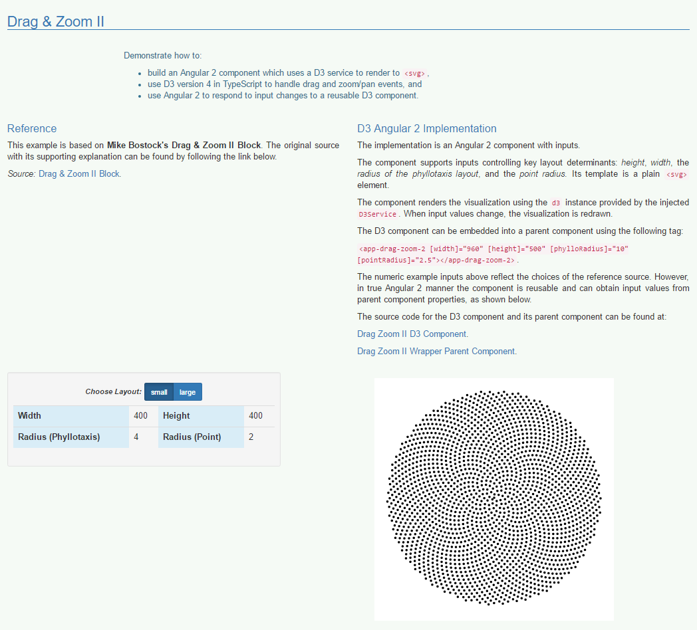

# Reusable Visual Power?

## Fuse D3 and Angular in TypeScript (A Demo)

Ever wondered, how to build modern web apps with reusable, interactive data visualization components?

The latest incarnation of **[D3](https://d3js.org/)** is getting you excited about new destinations. **[Angular 2](https://angular.io/)** arrived on the tarmac and has since been rolled into a stable release management cycle. [**TypeScript**](https://github.com/midrosoft/typescript) has become the fuel that lets you develop complex solutions at scale.

Integrating all three, however, seems as daunting as taking off in the perfect storm.

This Angular demo app is intended to get you started. Rather than trying to be exhaustive or writing a lengthy blog post, a select few well-known D3 demo scripts have been adapted to highlight key considerations:

* use an Angular Service to inject the power of D3 version 4 into a project,

* explore how D3 visualizations can be implemented as Angular components in TypeScript 2,

* see how a visualization component can change in response to input data changes,

* find ways to unit test your D3 components with Karma/Jasmine, and

* check out an example end-to-end test using Protractor.

_The running web app can be seen at:_ **[d3-ng2-demo Github Page](https://tomwanzek.github.io/d3-ng2-demo/)**.

## Explore this Project Locally

This project was generated with **[angular-cli](https://github.com/angular/angular-cli) version 1.0.0-beta.21**.

### Installation

In order to explore the project locally:

1. clone this git repository using `git clone https://github.com/tomwanzek/d3-ng2-demo.git`,
2. change into the project directory `cd d3-ng2-demo`, and
3. run `npm install`.

Now you are ready to explore the source code and use the features provided by **angular-cli** for your convenience.
A brief overview of the command line support provided by angular-cli is sketched out in the following subsections.

### Development Server
Run `ng serve` for a dev server. Navigate to `http://localhost:4200/`. The app will automatically reload if you change any of the source files.

### Code scaffolding

Run `ng generate component component-name` to generate a new component. You can also use `ng generate directive/pipe/service/class/module`.

### Build

Run `ng build` to build the project. The build artifacts will be stored in the `dist/` directory. Use the `-prod` flag for a production build.

### Running Unit Tests

Run `ng test` to execute the unit tests via [Karma](https://karma-runner.github.io).

### Running End-to-End Tests

Run `ng e2e` to execute the end-to-end tests via [Protractor](http://www.protractortest.org/).
Before running the tests make sure you are serving the app via `ng serve`.

### Further Help

To get more help on the Angular CLI use `ng help` or go check out the [Angular CLI README](https://github.com/angular/angular-cli/blob/master/README.md).
